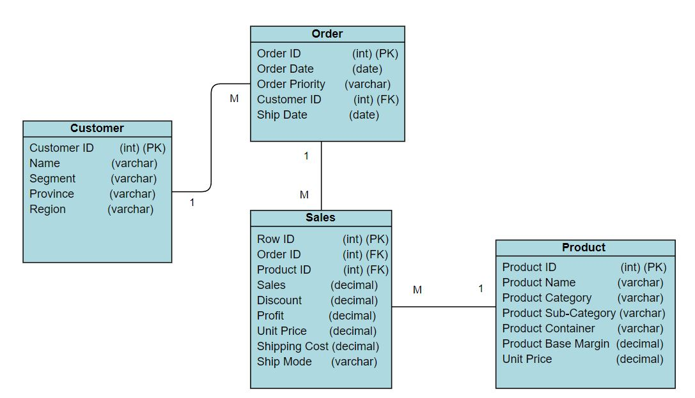
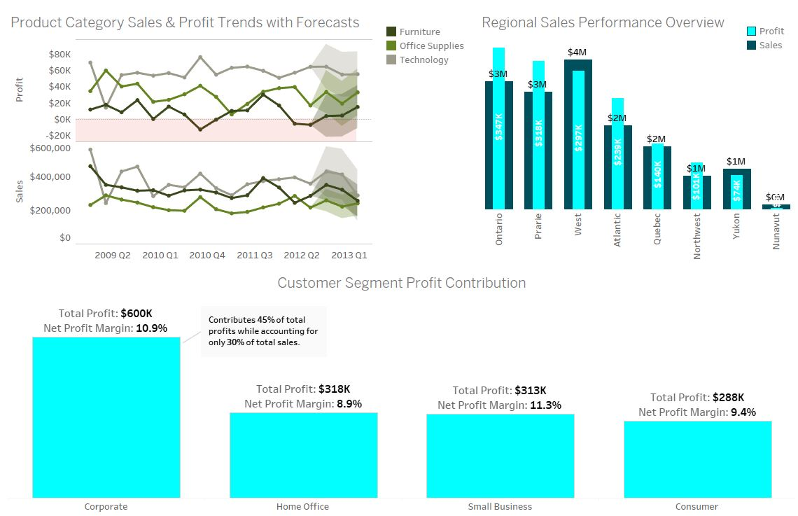
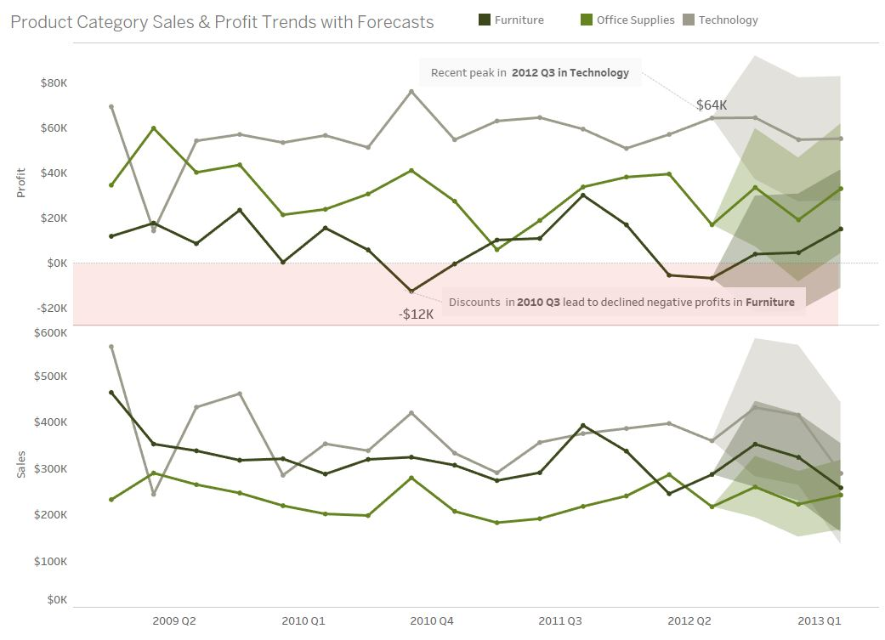
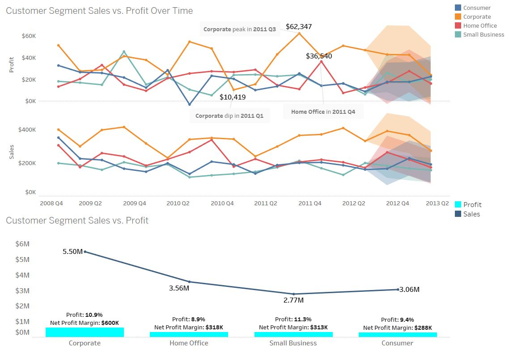
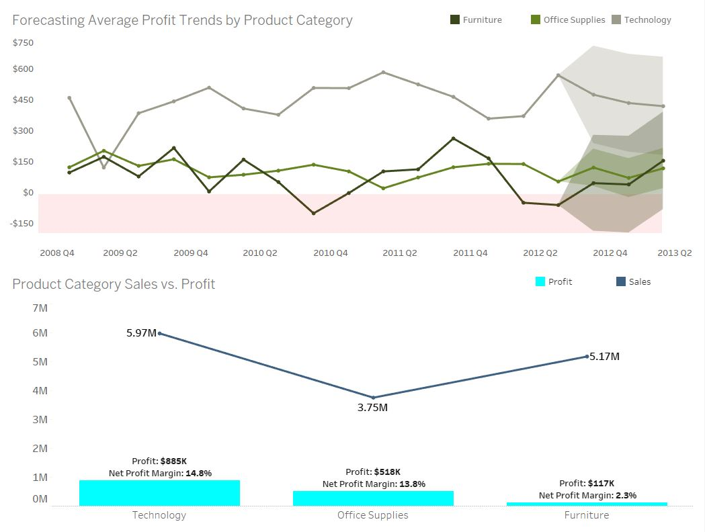
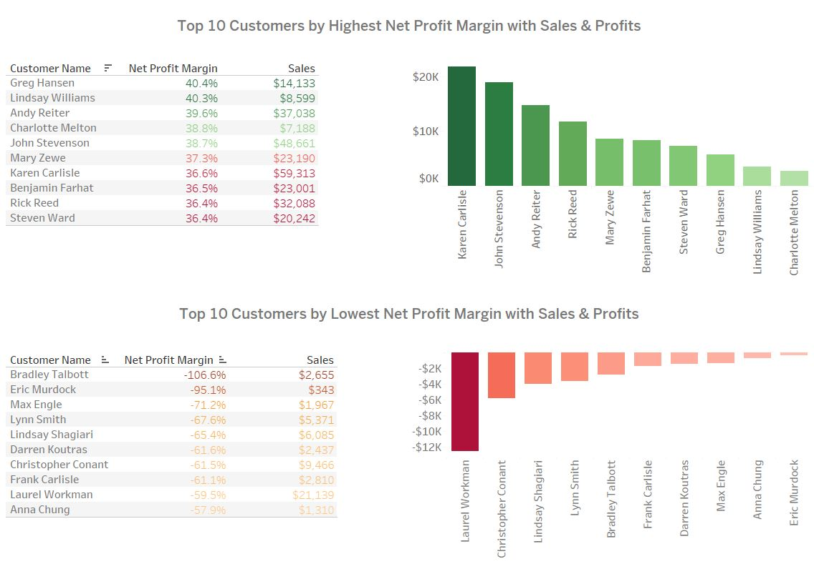
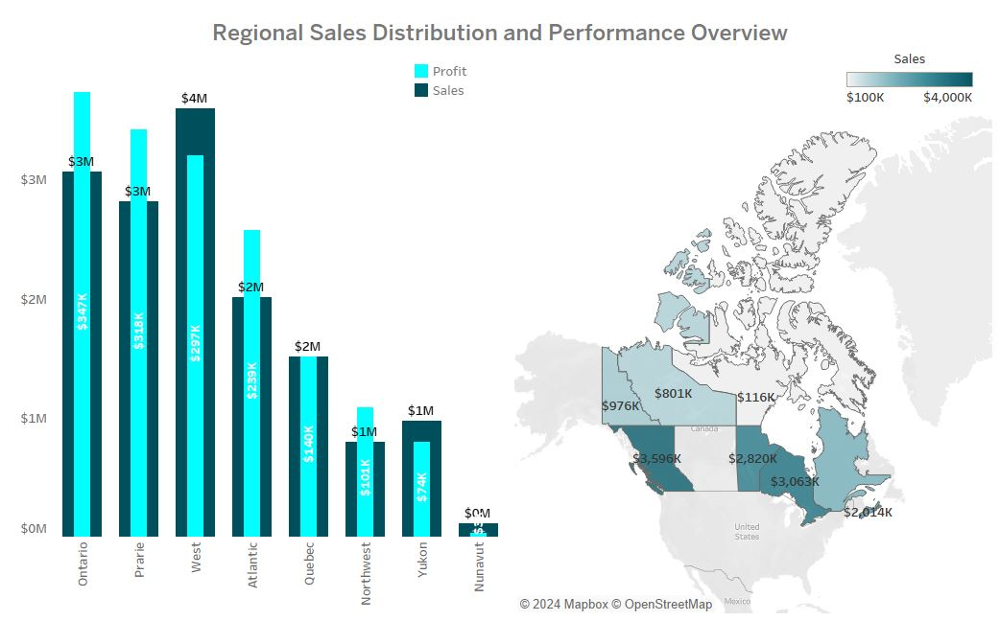

# Sales and Profitability Analysis

## Project Background
This analysis focuses on sales performance for a B2B supplier known for delivering tailored business solutions and high-quality products across various industries. Covering data from 2009 Q1 to 2012 Q3 and forecasting for the next 3 quarters, it aims to provide strategic insights for stakeholders, including executives and marketing teams, looking to optimize sales strategies and enhance profitability. The analysis targets **Total Sales**, **Total Profit**, and **Net Profit Margin**, with **Net Profit Margin** serving as the North Star Metric due to its crucial role in indicating operational efficiency, while **Total Profit** offers a direct measure of the company's overall profitability. 

Insights and recommendations are provided on the following key areas:
- Overall Sales Performance
- Customer Segment Analysis
- Product Category Profitability
- Customer Profitability 
- Regional Sales Distribution

An interactive **Tableau dashboard** used to report and explore sales trends can be found [here](https://public.tableau.com/views/SalesProfitabilityDashboard_17280732098650/Dashboard1?:language=en-GB&publish=yes&:sid=&:redirect=auth&:display_count=n&:origin=viz_share_link).

## Data Structure & Initial Checks
The company’s main database structure consists of the following key data tables, with a total row count of approximately 10,000 records in the data sample used. An Entity Relationship Diagram (ERD) is provided below to illustrate the relationships between these tables.

 

The **SQL queries** used to inspect and clean the data for this analysis can be found [here](./data_cleanup.sql).

## Executive Summary
### Overview of Findings
**Profit Peaks and Cyclical Trends**: Technology continues to drive profit peaks (latest in 2012 Q3) with forecasts indicating sustained performance, while Furniture faces ongoing profitability issues.

**Customer Segment and Product Profitability**: The Corporate segment leads in profit generation, producing $600K in profits from $5.5M in sales over the whole period, with a 10.9% profit margin. Technology stands out as the most profitable category, though Furniture remains inefficient, generating only $117K in profits from $5.17M in sales.

**Regional Sales and Profitability**: Ontario and the Prairies yielded strong profits relative to sales throughout the analysed period (2009 Q1 to 2012 Q3), while the Northwest boasted the highest profit margin at 12.6%, albeit with lower sales of $0.8 million. The West, despite leading in sales, struggled with lower profitability due to underperforming customers in the Technology category.

## Insights Deep Dive
### Category 1: Overall Sales Performance
- Technology experienced strong cyclical peaks, with 2012 Q3 marking the highest sales and profit figures. These peaks appear approximately every 12 months, suggesting a recurring trend in demand.

- Discounting that started in late 2010 triggered slight sales and profit increases for Technology and Office Supplies, but had a detrimental effect on Furniture, where profits dropped below zero, indicating that discounting adversely impacted Furniture’s profitability.

- Technology products consistently recorded the highest profits, notably peaking at approximately $64K in 2012 Q3. This highlights Technology's critical contribution to overall profitability during key periods.

- Forecasting suggests focusing on Technology for sustained profitability, with Furniture showing potential for recovery and Office Supplies maintaining its stable contribution to overall performance.

### Category 2: Customer Segment Analysis
- **Corporate**: Leading the profit race, the Corporate segment generated $600K in profits from $5.5M in sales, with a 10.9% profit margin. This demonstrates its efficiency and high profitability, despite only contributing 30% of total sales.

- **Small Business**: With $2.7M in sales, Small Business displayed strong growth, particularly in 2009 Q4, where profits spiked despite stable sales, indicating potential for future profit-driven strategies.

- **Consumer**: Although achieving $3 million in sales, this segment has experienced volatile profitability, particularly a dip in 2010 Q3, possibly linked to challenges in the Furniture category, highlighting the need for improved strategies to boost profit margins.

- **Home Office**: Demonstrating consistent growth, Home Office profits more than doubled from $13,000 in 2009 Q1 to $36,000 in 2012 Q1, despite stable sales during this period. This indicates potential improvements in cost management or pricing strategy, suggesting further investment could maximize returns.

### Category 3: Product Category Profitability
- Technology led in profitability with $885,000 in profits from $5.97M in sales, resulting in a 14.8% profit margin. The average profit peaked at $569 in 2012 Q3, reinforcing Technology's critical role in the product portfolio.

- Office Supplies delivered $518,000 in profits from $3.75M in sales, translating to a 13.8% profit margin. Though slightly lower than Technology, this category remains stable and dependable, with an average profit of around $120.

- Furniture underperformed, generating only $117,000 in profits from $5.17M in sales, resulting in a mere 2.3% profit margin. The significant drop in late 2010 suggests discounting had a more pronounced negative effect on this category compared to others.

- The performance disparity across categories indicates that improving Furniture's efficiency, perhaps through revised pricing or cost management strategies, could enhance overall profitability.

### Category 4: Customer Profitability Insights
#### Top 10 Customers by Highest Profit Margins:
- The top 10 customers recorded margins between 36.4% and 40.4%, highlighting efficient cost management and pricing strategies.

- **Gregg Hansen**: Stands out with the highest profit margin of 40.4%, generating $6,000 in profits from $14,000 in sales. Despite lower overall profits, his margin reflects cost control.

- **Karen Carlile**: Contributed the highest absolute profit, earning $22,000 from $59,000 in sales, with a 36.6% profit margin, showing her significant impact on total profitability.

- **Andy Reiter**: Ranked third, achieved a profit margin of 39.6%, generating $15,000 from $37,000 in sales, aligning with the overall strength of the Technology category.

#### Top 10 Customers with Lowest Net Profit Margins:
- The lowest 10 customers had negative margins ranging from -57.9% to -106.6%, indicating severe losses.

- **Bradley Talbott**: Reported the worst margin of -106.6%, with losses of $3,000 on sales of $2,655, highlighting critical issues such as pricing or product defects.

- **Laurel Workman**: Sustained heavy losses of $13,000 with a margin of -59.5% from $21,000 in sales, reflecting issues likely linked to negative profitability trends in Technology as seen earlier.

### Category 5: Regional Sales Distribution
- Ontario led in profitability with $347,000 from $3M in sales, slightly outperforming Prairies (which earned $318,000 in profit from the same sales figure). The Atlantic region, while generating $2 million in sales, achieved a higher profit margin of 11.9% compared to 11.3% for Ontario and Prairie.

- The West achieved the highest sales at $4M but ranked third in profit with $297,000, largely due to technology-focused customers sustaining losses, dragging down the region's overall profitability. 

- The Atlantic generated nearly half of the West’s sales but achieved similar profits, indicating a stronger profit-to-sales ratio, reflecting efficient operations in this region. Additionally, the Northwest region boasts the highest profit margin at 12.6%, although it has lower sales of $0.8 million.

- Other regions maintained profit margins close to 10%, with Yukon significantly underperforming, possibly due to higher costs or weak sales of high-margin products.

## Recommendations
Based on the insights and findings above, I recommend the following actions:
1. **Maximize Technology Sales**: Capitalize on cyclical growth trends by increasing focus on high-margin Technology products. Tailor marketing to sustain strong sales performance.

2. **Improve Furniture Margins**: Address low profitability in Furniture by optimizing pricing strategies and streamlining costs to enhance margins.

3. **Strengthen Corporate Segment Focus**: Develop targeted retention and upselling strategies for the Corporate segment, which offers the highest profitability potential.

4. **Mitigate Losses in the West Region**: Investigate and rectify negative margins from Technology sales in the West. Focus on product quality and pricing improvements to reverse losses.

5. **Boost Home Office Sales Through Bundling**: Introduce bundled offers to increase average order values and profitability in the Home Office segment.

## Assumptions and Caveats
Throughout the analysis, the following assumptions were made:

- Missing data for certain regions was assumed to be from the company's headquarters province, which could potentially impact regional analysis.

- It was assumed that customer demographics remained relatively stable over the analyzed period, allowing for consistent comparisons across different customer segments.

- The sales and profit data were assumed to be accurately recorded, with no significant errors in the transactional records that could distort the analysis.

- Product defects or aging inventory were considered likely factors contributing to negative profit margins in specific regions, necessitating further investigation and remedial action.
